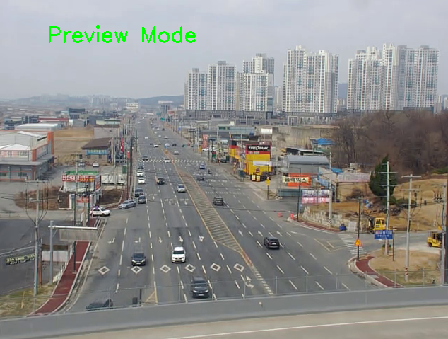
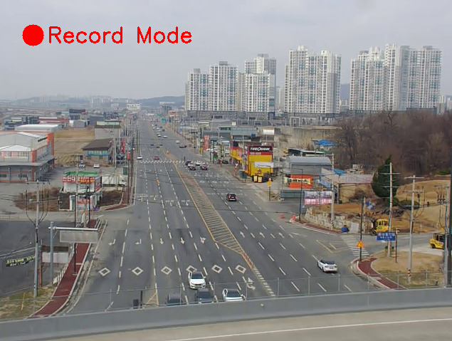
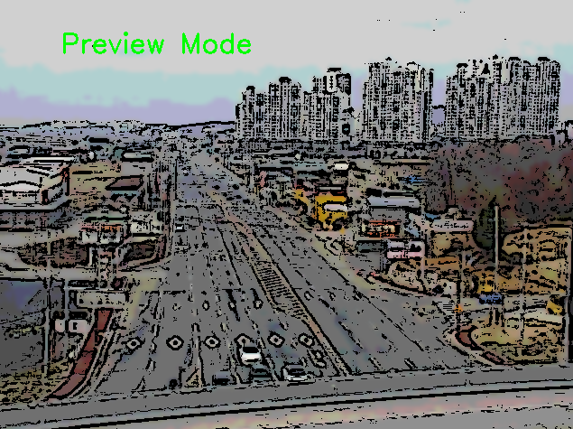
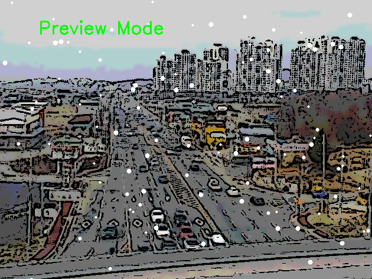
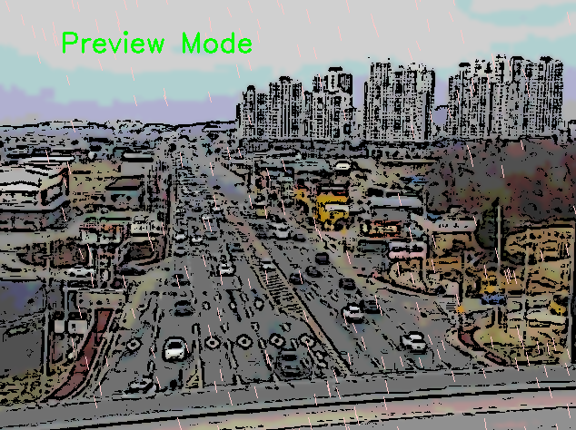
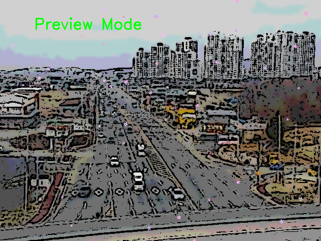

  # Cartoon Recorder
  
  OpenCV를 활용하여 카툰 필터와 파티클 효과를 적용할 수 있는 비디오 녹화 프로그램입니다.
  
 ## 스크린샷
 
 ### 프리뷰 모드
 
 프리뷰 모드에서는 실시간으로 필터와 효과가 적용된 화면을 미리 확인할 수 있습니다.
 
 ### 녹화 모드
 
 스페이스바를 눌러 녹화 모드로 전환하면 좌측 상단에 빨간색 녹화 표시가 나타나며 영상이 저장됩니다.
 
 ### 카툰 효과
 
 'C' 키를 눌러 카툰 효과를 적용할 수 있습니다.
 
 ### 파티클 효과
 각 효과는 해당 키를 눌러 켜고 끌 수 있습니다:
 
 
 - 'S' 키: 눈 효과
 
 
 - 'R' 키: 비 효과
 
 
 - 'F' 키: 꽃잎 효과
 
  ## 주요 기능
  
  1. 실시간 카툰 필터
      - 만화풍 스타일로 변환 (C키)
  
  2. 파티클 효과
      - 눈 효과 (S키)
      - 비 효과 (R키)
      - 꽃잎 효과 (F키)
  
  3. 녹화 기능
      - 프리뷰 모드에서 효과 미리보기
      - 스페이스바로 녹화 시작/중지
      - AVI 형식으로 저장
      - 필터와 효과가 적용된 상태로 저장
  
  ## 설치 방법
  
  1. 필요한 패키지 설치:
  ```bash
  pip install opencv-python numpy
  ```
  
  ## 사용 방법
  
  1. 프로그램 실행:
  ```bash
  python Cartoon_recorder.py
  ```
  
  2. 단축키:
  - `Space`: 녹화 시작/중지
  - `C`: 카툰 필터 켜기/끄기
  - `S`: 눈 효과 켜기/끄기
  - `R`: 비 효과 켜기/끄기
  - `F`: 꽃잎 효과 켜기/끄기
  - `ESC`: 프로그램 종료
  
  ## 저장 위치
  
  녹화된 영상은 `Video` 폴더에 저장되며, 파일명은 녹화 시작 시간으로 자동 지정됩니다. 